  

 

I like problems where the interesting part lives *underneath* the library call — so most of what I build, I build from scratch: a neural net in raw NumPy, a mark-and-sweep garbage collector in C, a graph-cut image segmenter, an interpreter grown from a PEG grammar.

> *"Everything I care about is an optimization problem — the only question is whether I'm solving it or living it."*

 

## What the code says

These charts aren't a widget — they're generated by [`scripts/build_charts.py`](scripts/build_charts.py) in this repo. A [GitHub Action](.github/workflows/refresh-charts.yml) pulls live stats from my repositories every Monday and re-renders the SVGs, so the numbers below are always current.

  <picture>
    <source media="(prefers-color-scheme: dark)" srcset="assets/langs-dark.svg">
    
  </picture>
    
  <picture>
    <source media="(prefers-color-scheme: dark)" srcset="assets/concepts-dark.svg">
    
  </picture>

 

## Selected work

| Project | The interesting part | Built with |
|---|---|---|
| [**image-segmentation**](https://github.com/doorukb/image-segmentation) | Image segmentation from scratch via max-flow/min-cut over a pixel graph — no CV libraries doing the thinking |  |
| [**multicore-task-scheduler**](https://github.com/doorukb/multicore-task-scheduler) | A scheduler engine simulating a multi-core CPU, built on real OS scheduling concepts |  |
| [**peg-interpreter**](https://github.com/doorukb/peg-interpreter) | Tree-walking interpreter for a JS-like language — closures, recursion, and block scoping that actually behave |  |
| [**markov-music-engine**](https://github.com/doorukb/markov-music-engine) | Hierarchical Markov chains that learn structure from music and generate their own |  |
| [**baby-garbage-collector**](https://github.com/doorukb/baby-garbage-collector) | A dependency-free mark-and-sweep garbage collector for C |  |
| [**smart-syllabus-scanner**](https://github.com/doorukb/smart-syllabus-scanner) | Document-intelligence pipeline: raw PDF/PNG/TXT syllabus in, structured schedule out |  |

More in the repositories below — from a [multilayer perceptron built entirely from scratch](https://github.com/doorukb/multilayer-perceptron) (and its [PyTorch twin](https://github.com/doorukb/pytorch-multilayer-perceptron)) to a [canvas-rendered drone-fleet simulation](https://github.com/doorukb/drone-fleet-dispatch).

 

## Toolbox

 

## Reach me

Studying Computer Science (with a secondary major in Applied Math and a minor in Business Administration) at the **University of Massachusetts Amherst** — currently writing code from Istanbul.

 

---

  
    This README rebuilds itself: <a href=".github/workflows/refresh-charts.yml">workflow</a> → <a href="scripts/build_charts.py">generator</a> → charts.
     
    
  

